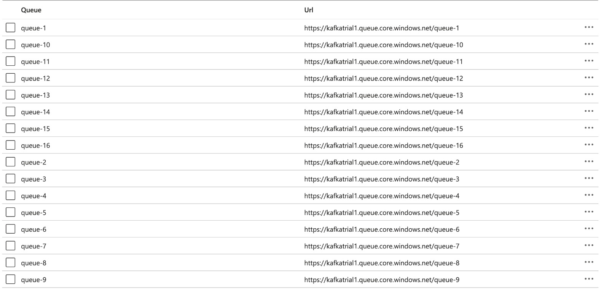
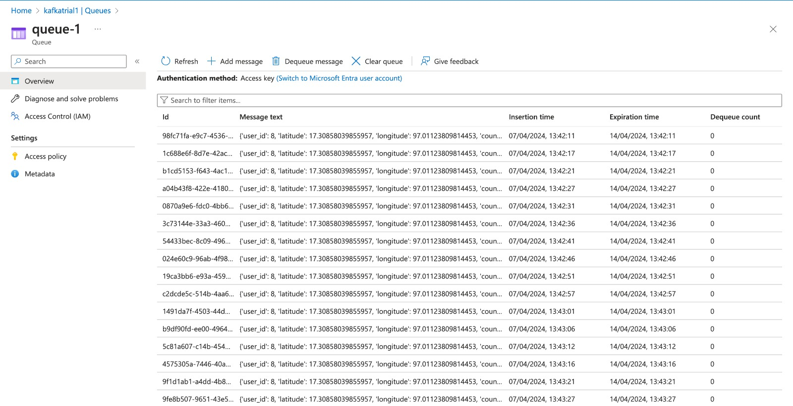
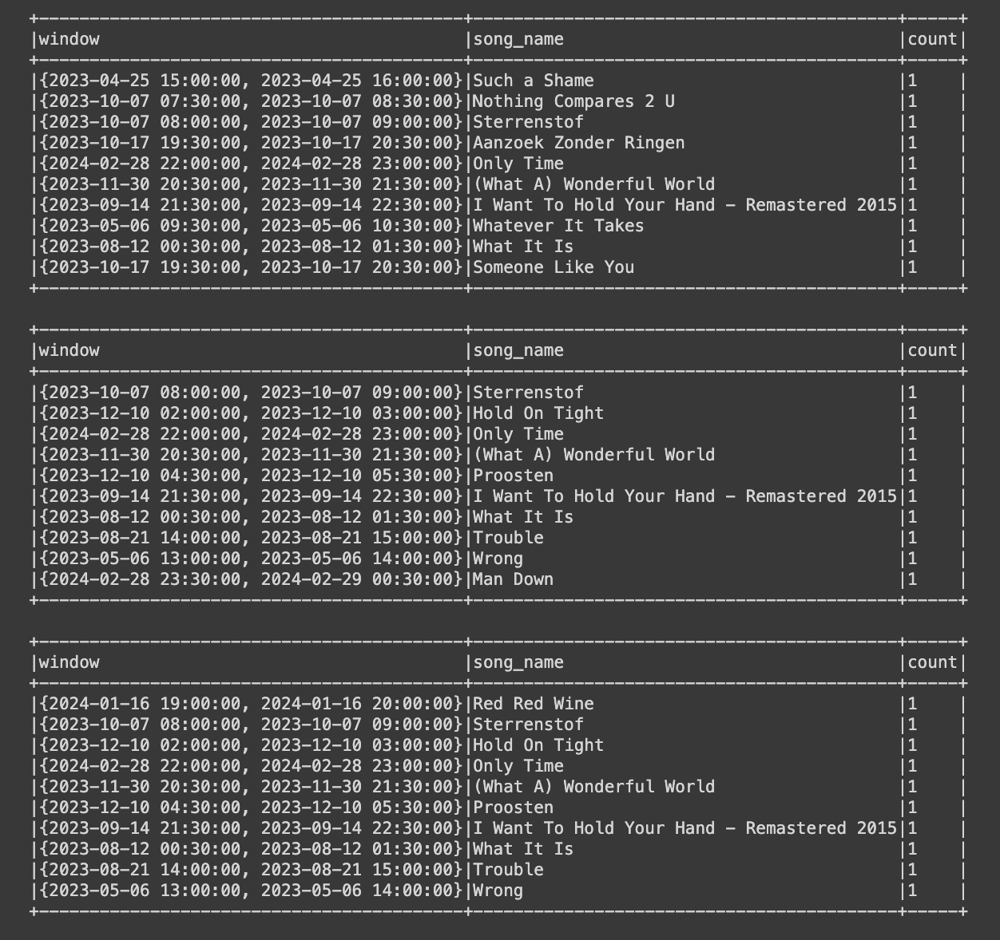
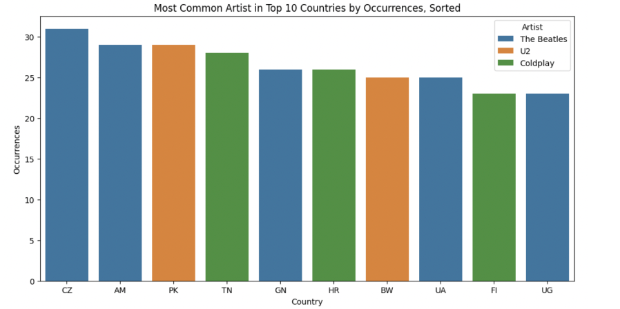
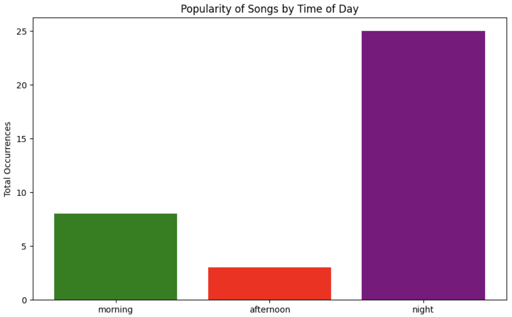
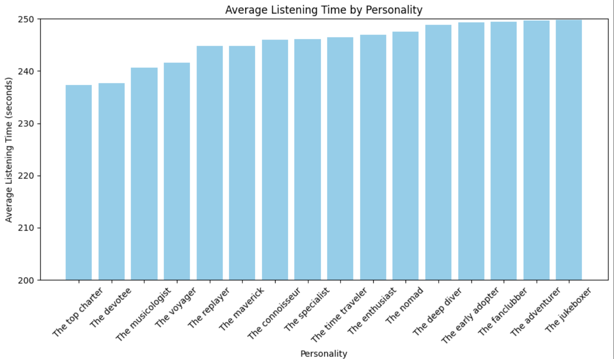

# **Overview**

- Our project moves from the creation and simulation of data in Milestone 1 to analysing that data in real time in Milestone 2.
- In Milestone 1, we started by making a strong AVRO schema for Spotify Wrapped, making it possible to simulate real-life, time-ordered data showing how people interact with a music streaming service. This step allowed us to build a detailed model of how songs are played and how users interact with them, creating fake data that represents how individuals and groups use streaming services.

- Moving to Milestone 2, we aim to deeply analyse this data as it happens. Now, we focus on using our data to find meaningful insights, going beyond just making data, to using it to make informed decisions.
- This process will involve sending AVRO records to a Kafka topic, to then use Spark to consume the records and perform the analysis with SQL queries, as well as sending notifications to Azure queues.

## **Analysis Objectives**

The analyses are structured around the following objectives, each aiming to shed light on different dimensions of user behavior:
- **Listening Stats: Night vs Day** - Utilizing a 6-hour fixed window with a 1-hour watermark to dissect and understand the listening patterns that distinguish night-time listeners from day-time ones. This analysis aims to explore the temporal nuances of music consumption, providing insights into when users are most engaged with the platform.
- **Country Statistics** - Delving into geographical data to uncover trends and preferences across different regions. This objective seeks to highlight the diversity of musical tastes around the globe and how they shape the global music streaming landscape.
- **Personality Statistics** - Employing Azure queues to capture and analyze listening habits segmented by user personality types. This analysis is particularly innovative, as it uses a dedicated queue for each personality type, enabling a granular view of how different personalities interact with music.

## **Dependencies** 

Ensure Python 3.x is installed on your system, as the scripts are designed to be compatible with Python 3, specifically tested on Python 3.10. The libraries used are:

- **fastavro**: A library for working with AVRO files, used for efficient data serialization and deserialization. 
- **pandas**: Provides powerful data structures and tools for data manipulation and analysis.
- **Faker**: Used for generating fake data, such as names, addresses, and timestamps, to simulate realistic user profiles.
- **pytz**: A Python library for accurate and cross-platform time zone calculations.
- **pycountry**: Utilizes ISO country codes and names, enhancing geographic data realism.
- **requests**: Allows HTTP requests to be sent, useful for web scraping or API interactions.
- **beautifulsoup4**: A library for parsing HTML and XML documents, often used in web scraping.
- **datetime, timedelta (from datetime)**: Built-in libraries for handling and manipulating dates and times.
- **relativedelta (from dateutil)**: Provides additional functionality for manipulating dates and times beyond what's available in the standard library.
- **findspark**: Used for initializing SparkContext in PySpark applications, making it easier to connect to Spark clusters.
- **pyspark**: The Apache Spark Python API, enabling Python programming for Spark, a fast and general engine for large-scale data processing.
- **azure-storage-queue**: Allows interaction with Azure Queue Storage, providing cloud messaging between application components.
- **IPython.display**: Offers a variety of display options within Jupyter notebooks for rich content.

## **AVRO Schema Design** 

- AVRO is the most appropriate format for the Spotify Wrapped project due to its schema evolution, data compression, serialization efficiency, and tool ecosystem support.
- Below is the AVRO schema defined in JSON format (can be found in the github repo as `spotify_schema.json`):

```json
{
 "doc": "User listening history with song details.",
 "name": "ListeningHistory",
 "namespace": "music",
 "type": "record",
 "fields": [
   {"name": "user_id", "type": "int"},
   {
     "name": "user_location",
     "type": {
       "type": "record",
       "name": "Location",
       "fields": [
         {"name": "latitude", "type": "float"},
         {"name": "longitude", "type": "float"},
         {"name": "country", "type": "string"},
         {"name": "city", "type": "string"},
         {"name": "timezone", "type": "string"}
       ]
     }
   },
   {"name": "interaction", "type": "string"},
   {"name": "song_name", "type": "string"},
   {"name": "artist", "type": "string"},
   {"name": "genre", "type": "string"},
   {"name": "year", "type": "int"},
   {"name": "popularity", "type": "int"},
   {"name": "danceability", "type": "float"},
   {"name": "energy", "type": "float"},
   {"name": "length_seconds", "type": "int"},
   {
     "name": "listening_time",
     "type": {
       "type": "record",
       "name": "ListeningPeriod",
       "fields": [
         {"name": "start_time", "type": "long"},
         {"name": "end_time", "type": "long"}
       ]
     }
   },
   {"name": "personality", "type": "string"}
 ]
}
```

## **For reference: Listener Personalities**
There are 16 personalities: the combinations of these 4 binaries.
- **Familiarity vs. Exploration (F/E):** Whether the user prefers playing songs from favorite artists (Familiarity) or discovering new artists (Exploration), quantified using an "affinity" score.
- **Timelessness vs. Newness (T/N):** This measures the preference for new releases versus older music.
- **Loyalty vs. Variety (L/V):** Evaluates if a user listens to the same songs repeatedly (Loyalty) or prefers a wide range of different songs (Variety)
- **Commonality vs. Uniqueness (C/U):** Look at whether users listen to popular music known by many (Commonality) or seek out lesser-known tracks (Uniqueness). Listening to the top gobal song on Spotify daily would score towards Commonality, while playing only obscure artists scores towards Uniqueness.
- 

# **Methodology and Code Overview**

## Milestone 1

### Initialization

- **utc**: A timezone-aware datetime object initialized with UTC timezone to ensure consistent time representations across the dataset.
- **personalities**: A dictionary that outlines various user listening personalities along with their characteristics, influencing song selection and user interaction simulations.
- **song_df**: A pandas DataFrame derived from the original dataset, filtered to include only relevant columns for the simulation (e.g., Title, Artist, Genre).
- **user_song_history**: A dictionary utilized to maintain a record of songs each user has interacted with, helping to simulate realistic listening patterns.
- **records**: An accumulating list where records of user interactions are stored, ready for serialization.
- **user_country_mapping**: A dictionary that maps each user to a country, used to generate consistent and realistic user locations.

### Functions

- **Dynamic Song Selection** (`dynamic_song_selection`): Selects songs dynamically for users based on their year preference while ensuring the song hasn't been previously listened to by the user. It randomly selects a preferred decade, filters the songs in the db release in that decade, excludes previously listened songs, and randomly selects a song from the filtered list.
- **User Interaction Simulation** (`simulate_interaction`): Simulates a user's interaction with a song, including actions such as play, pause, skip, repeat, and addition to playlist, with predefined probabilities for each action.
- **Enhanced Dynamic Song Selection** (`dynamic_song_selection_2`): An extension of dynamic_song_selection incorporating user personality traits to refine song selection further, aiming for a diverse and personalized experience. It uses personality-based filtering to align song choices with user preferences.
- **Country Code Generation** (`generate_valid_country_code`): Produces a valid two-letter country code to accurately simulate geographical locations.
- **User Location Generation** (`generate_user_location`): Determines or retrieves a user's location (latitude, longitude, city, country, timezone) based on user ID and a country mapping, ensuring consistent location data across sessions.
- **Song Filtering** (`filter_songs`): Filters songs using specific features (Exploration, Newness, Loyalty, Commonality) to refine selections based on user behavior or preferences.
- **Record Generation** (`generate_record`): Constructs detailed records of user-song interactions, capturing various data points such as user ID, location, interaction type, song details, listening time, and personality traits for realistic data simulation.
- **User Session Simulation** (`simulate_user_session`): Simulates a user's listening session, incorporating parameters such as user ID, session start time, duration, personality, song history, and location. The function calculates the session time, generates the user locations, iterates terates over the session, selecting songs and simulating interactions, and records each song interaction, updating the user's song history to reflect new interactions.

### Usage

To initiate the simulation, execute the `main` function specifying the desired parameters: number of sessions per user, range of session durations (in hours), and total number of users to simulate. This process orchestrates the simulation of user interactions.
- It iterates through user IDs, simulating sessions for each. Assigns a random personality to each user. Initializes a list to store session records for each user. For each session: It selects a personality and generates a random start time, determines the session duration, and calls simulate_user_session to generate session records. Then it, appends these records to the user's session records list.
- It Utilizes fastavro for serialization of the simulated data into AVRO format, using a BytesIO stream for temporary data holding.
The serialization schema is defined by spotify_wrap_schema. Outputs the total size of the serialized data for insight into the generated data volume.
- The serialized data is saved to a file named spotify_wrapped_data.avro, ensuring the session data is stored persistently in a format ready for efficient querying and analysis.

## Milestone 2

### Kafka

- `environment.sh`: This shell script sets environment variables and amend the system's PATH variable to include the binary directory of Kafka, thereby facilitating easy execution of Kafka commands.
- `kafka_setup.sh`: automates the setup and initial configuration of Apache Kafka: steps for environment variable sourcing, Java setup, Kafka downloading and extraction, and Kafka broker initialization.
- We then run the two shell scripts, and utilise the  the kafka-topics.sh script to create a new Kafka topic on the local machine, named spotifyWrapGroup4.
- It has 16 partitions, which aligns with the intention to analyse data by 16 different personalities, allowing for dedicated partitions for each personality type.
- `check_kafka_consumers.sh`: continuously monitor and display information about all active Kafka consumer groups.This command outputs detailed information about each consumer group, including Group ID, Topic, Partition, Current Offset, Log End Offset, Lag, Consumer ID, Host, and Consumer Group State. We retired the output to a file named kafka_consumers.log.
- `avro_producer.py`: script designed to generate and send serialized data records to a Kafka topic (following the code from part 1).
- `avro_producer2.py`: script for sending data to a Kafka topic, but unlike the first script, this one focuses on reading pre-existing AVRO records from a file and publishing them to Kafka (instead of generating the data, which takes a long time).
- `avro_consumer.py`: script designed to consume and deserialize messages from a Kafka topic using AVRO serialization.
- The three scripts above are run in the background. We then inspect the Kafka consumer group to see the topics, partitions, current offset, lag…

### Spark

- **Spark/Hadoop Versions and Environment Variable Configuration**: We define the Spark version, specify compatibility with Hadoop to use HDFS, set the start time for operation duration calculations, set the environment variables for Spark and Hadoop versions, define the Java 8 OpenJDK installation path (a prerequisite for Spark), and construct the Spark installation directory.
- **Installation**: We install Java, the headless version of OpenJDK 8, in order to run Spark (which is written in Scala). Download and set up Spark. Initialise Findspark to use Spark's shell in the notebook. Import Spypark. Set up variables for Kafka brokers and topic name (created earlier). Provide guidelines for creating a Spark session that connects to Kafka. This involves specifying the Kafka cluster details, topic name, consumer group, and the AVRO schema of topic messages.
- **Initialization**: Initialise the Spark Session, setting the application name StreamingAVROFromKafka and specifying other details (for eg. setting the number of partitions to use when shuffling data for joins or aggregations to 4).
- **Kafka Configuration for reading from Kafka/Event Hub**: It outlines the setup of Kafka configuration parameters, how to initiate a streaming read from a Kafka topic, and some considerations for secure Kafka clusters: bootstrap servers, topic subscription, starting offsets, auto commit, group ID prefix…
- **Flattening the AVRO record**:The df (deserialized AVRO records from a Kafka stream) by flattening the data structure so that each field of the AVRO record is mapped to a separate column in the DataFrame. This step makes the DataFrame easier to work with for further analysis or processing within Spark.

### Setting up Azure and the Windowing

- **Azure**: We dynamically route messages to different Azure Storage Queues based on the content of each record, specifically the personality attribute. Define a Azure Storage Account, and create a map for the personality queues to different Azure queues. Define a send_to_queue function to send the data from each record in the streaming data frame. 





- **Windowing**: This is a Spark streaming query that aggregates song play counts within fixed windows of time. With this, we can identify the top songs played during specific intervals.
    - The start_time column, initially in epoch milliseconds, is converted into a more human-readable timestamp format. This is done by dividing the epoch time by 1000 (to convert milliseconds to seconds) and casting the result to a "timestamp" data type.
    - The DataFrame is then filtered to retain only rows where the interaction is "played", focusing the analysis on songs that were actually listened to.
    - A fixed window duration is defined ("1 hour"), which specifies how long each window lasts.
    - A sliding duration is also defined (e.g., "30 minutes"), indicating how frequently a new window starts-
    - These parameters set up overlapping windows that allow for continuous analysis over time, with each window capturing one hour of data and a new window starting every 30 minutes
    - The code groups the filtered DataFrame by both the window and song_name, counting the number of times each song was played within each window.
    - The aggregation results are set up to be output to an in-memory table, allowing for dynamic querying of the aggregation results as the data stream is processed.



### Query 1: Country Analysis

- **Top country per personality**:
    - We select and filter the necessary columns (personality and country) from the main DataFrame. We initialise a streaming DataFrame to output results dynamically, configure the stream to output only updated rows in the result table since the last trigger, and sets the output format to an in-memory table.We then activate the stream, allowing it to continuously update the in-memory table as new data is ingested
    - The, we run a SQL query to identify the top 10 countries per personality using nested SQL operations: inner SELECT for occurrences of each personality and country, GROUP BY country and personality, and outer SELECT for ranks within each personality group by occurrence, and filter to retain only the top 10 countries for each personality. 

- **Top artist per country**: 
    - Similar initial process: select and filter necessary columns (country and artis), initialise a streaming DF to output an in memory table, etc.
    - Then, we run a SQL query to identify the top artist per country using nested SQL operations: inner SELECT for occurrences of each country and artist, GROUP BY country and artist, and outer SELECT for ranks within each country group by occurrence, and filter to retain only the top artist for each country.

### Query 2: Day vs Night Listening Behaviour

- **Night Playlist Analysis**: 
    - First, convert epoch milliseconds in the start_time and end_time columns to human-readable timestamps.Extract the hour from both start_time and end_time. Defines "night" as hours from 10 PM to 5 AM using the when function.
    - Filters the DF for plays that occur during the night time. Sets up a query that groups the data by song_name (and optionally by country), counts occurrences, and sets up a streaming query to maintain this aggregation in memory.
    - SQL query displays the top 10 most played songs at night.

- **Morning Playlist Analysis**:
    - Similar steps are repeated, but for morning hours (from 6 AM to 11 AM).

- **Day vs. Night Analysis**:
    - Adds conditions for morning, afternoon, evening, and night using when clauses.
    - Groups by song_name and time_of_day, counts plays, and starts a streaming query to display results for different times of day.

- **Day vs. Night Analysis Using Windows**:
    - Sets up a 6-hour window with a 1-hour watermark to handle event-time aggregation.
    - Configures the streaming DataFrame to group data by song, time of day, and a defined window, then starts the streaming query.
    - Then, executes an SQL query to retrieve the most played songs across defined windows, ordered by play count.

### Query 3: Listening stats per Personality

- **Most popular Song Name, Artist, and Genre per Personality**:
    - We select and filter the necessary columns (personality, interaction, song name, artist, genre) from the main DataFrame.
    - We then initialise a streaming DF, activate the stream, etc.
    - We run a SQL query  to identify the most used interaction, most listened song, artist, and genre for each personality. This involves an inner SELECT (aggregation to count occurrences for each combination), GROUP BY, ordering and filtering by count in descending order to place the most frequent combinations at the top of the list for each group.

- **Listening Time Analysis per Personality**:
    - DataFrame is created with the relevant columns and then filtered to include only rows where the 'interaction' column has the value 'played'. 'length_seconds' is cast to an integer to facilitate numerical operations.
    - We group the data by 'personality' and then aggregate it to calculate the total and average listening time in seconds. The total listening time in seconds is converted to minutes. A streaming query is configured, and the update aggregates per personality.

## Results

### Query 1: Country Analysis

- **Analysis**:
- The Beatles, Coldplay, and U2 exhibit distinct patterns of popularity across various countries, and dominate as the most listened to artists. 



| CONTINENT  | PERSONALITY      |
|------------|------------------|
| ASIA       | THE FANCLUBBER   |
| EUROPE     | THE ADVENTURER   |
| AFRICA     | EARLY ADOPTER    |
| NORTH AMERICA | THE DEEP DIVER  |
| SOUTH AMERICA | THE ENTHUSIAST |
| OCEANIA    | THE DEVOTEE      |

- In Asia, "The Fanclubber" personality suggests listeners are highly engaged with specific artists or genres, perhaps following fan trends. 
- Europe's "The Adventurer" indicates a preference for diverse and new music experiences. 
- "Early Adopter" in Africa could reflect a tendency toward embracing new music quickly.
- "The Deep Diver" in North America implies listeners enjoy exploring music in detail. 
- South America's "The Enthusiast" personality points to a passionate listener base.
- Important to note that each region has a distinct dominant personality, which could be used to shape Spotify’s strategy in each of them.
 
- **Importance and Practical Application**:
    - Identifying regional trends to see if certain personalities are more prevalent in specific regions.
    - Determining the top artists can help identify if certain artists dominate multiple countries, forming geographic clusters.
    - These insights can also be used for targeted marketing strategies, recommender system refinement, localised content strategies, strategic artist collaborations…
    - It can be relevant also to design a market entry strategy / business development strategy in an underdeveloped market.

### Query 2: Day vs Night Listening Behaviour

**Analysis**:
-  The night category exhibits a significantly higher number of occurrences compared to morning and afternoon, suggesting that listening activity increases substantially during the night. The most popular songs for each period also seemed to be different. 



**Importance and Practical Application**:
- Understanding when certain songs or artists are popular helps tailor user experience, such as creating night-time or morning playlists that match user preferences during those times.
- Time-based segmentation allows for more precise personalization, improving user engagement by aligning music recommendations with listeners' daily routines.
- Can help design content strategy including promotional timings and targeted advertising based on user activity peaks during specific parts of the day.
- Improve to manage and scale its data processing pipelines to handle large volumes of data dynamically.

### Query 3: Listening stats per Personality

**Analysis**:
- All the personality types have an average listening time within a relatively narrow range—between approximately 210 and 240 seconds. None of the personality types dip below 210 seconds or exceed 240 seconds, indicating a fairly consistent listening behaviour across different personalities.



| Favourite genres | Count |
|------------------|-------|
| Album rock       | 10276 |
| Dutch Indie      | 4556  |
| Dutch Pop        | 3606  |

| Favourite songs | Count |
|-----------------|-------|
| Hunger Strike   | 626   |
| Night Fever     | 625   |
| Wind of Change  | 625   |

- There are many genres of rock among the top most listened genres, and the three most popular artists as seen before are rock bands. There are also two Dutch genres in the top 3, showcasing that the Netherlands has a particularly strong musical scene. 
- The top songs might represent tracks that are currently trending or have timeless appeal, in both cases it is relevant to include them in suggested playlists

**Importance and Practical Application**:
- Personalised content strategy, by tailoring  their content offerings and playlist curation to better match user preferences. Can guide targeted advertising and promotional campaigns. 
- Recommendation algorithms can be fine-tuned to deliver more of what users love, potentially increasing the time they spend on the platform.
- By knowing the common preferences of personality groups, platforms can design shared listening experiences or social features that allow users to connect over common musical interests. 
- Regarding the time analysis: 
- Longer average listening times can indicate higher engagement and satisfaction with the platform, suggesting that the content and user experience are well-aligned.
- Higher engagement often correlates with better retention rates - there can be a focus retention strategies on user segments that may require more attention or improvement.
- Personalities with shorter average listening times might benefit from features that encourage prolonged interaction, such as personalised playlists.

## Challenges Faced

- **Integration Complexity**: Integrating multiple complex systems such as Spark, Kafka, and Azure Queues posed significant challenges. One notable issue was encountered during the conversion of a Jupyter notebook into a working Python script (producer.py) for Kafka. This transition was challenging due to differences in the execution environments between interactive notebooks and standalone Python scripts. Furthermore, setting up the connection to Azure Queues to send the streaming information to the Azure storage account presented issues at first, but eventually it was overcome and the whole process works smoothly from start to end. 

- **Performance Optimisation**: Optimising the performance of Kafka consumers/producers along with Spark streaming jobs presented multiple hurdles when managing resource allocation, processing time, and latency. For instance, a real-time producer intended to handle streams for 1,000 users was only capable of managing about 40 users after several hours. To address this, a secondary producer was introduced to directly load user data from an AVRO file, ensuring that data for 1,000 users was readily available for analysis. This approach allowed for the operational streaming analytics to be kept in place, while in practice the analysis leveraged a complete dataset (instead of less than 10% of the intended real-time data flow). 

- **Windowing and Analytical Challenges**: Understanding and effectively leveraging windowing functions in Spark to improve analytics was another challenge. Correctly applying window functions for time-based aggregations and stream processing required a deeper understanding of Spark's windowing capabilities. We did implement a fixed window and watermark, but we believe we could have gone a step further.
    - We implemented fixed windows because they are more straightforward to understand. Because the windows do not overlap, each data element is processed exactly once per window. 
    - Due to the clear separation of data batches, we thought it would be more suitable when doing analysis of non-overlapping periods. Initially our analysis was going to be comparing different times of the day, although we ended up doing Nights versus Daytime, and Morning vs Afternoon vs Evening vs Night  
    - However, the sliding windows allow more frequent data as they overlap and shift incrementally over the stream. This is crucial for monitoring user activities and interactions in real-time, especially as every listening session starts and ends at completely different times. 

- **Synthetic Data Limitations**:  The use of synthetic data introduced challenges, particularly in the relevance and insightfulness of the analytics. Since the data was randomly generated, analyses such as user behaviour by country or time of day were less insightful, lacking real-world trends and behaviours. Although user personalities were modelled to influence song choices this was not sufficient to fully emulate realistic user activity.
## Future Improvements
- **Enhance synthetic data**: As mentioned in the challenges part, although we did our best to create data that accurately represents human behaviour, we expected to find insights that seemed more logical and closer to real trends. So one way to improve our project would be to spend more time on synthetic data generation, and making it as real as possible to find insights that are more meaningful and interpretable. One way to do this is to use state of the art tools like Gretel.AI to produce it, or taking the time to train a machine learning model from scratch. 

- **Implement sliding windows**: Implementing sliding windows instead of fixed windows will capture more nuanced trends in user behaviour over time by creating overlapping intervals, providing a more dynamic view of user interactions and will make real-time detection of emerging patterns easier.
